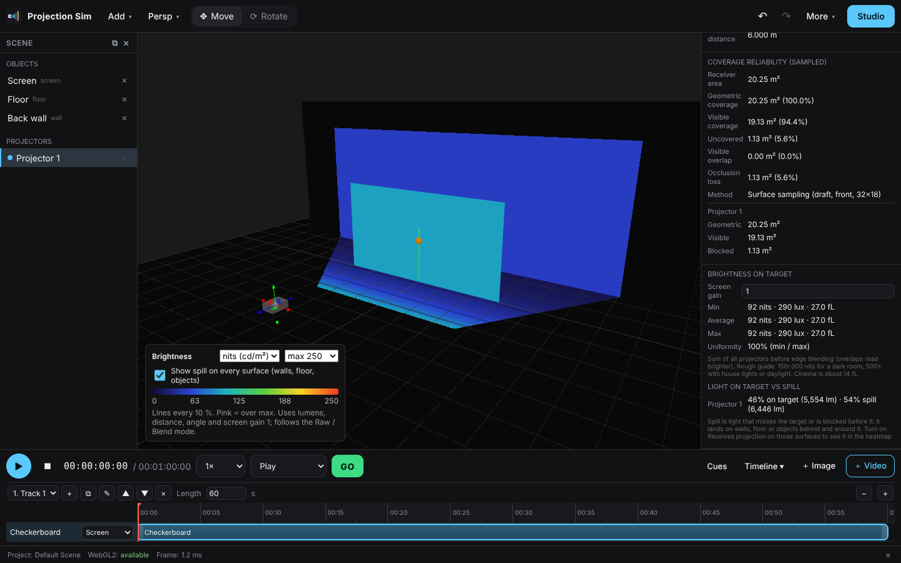
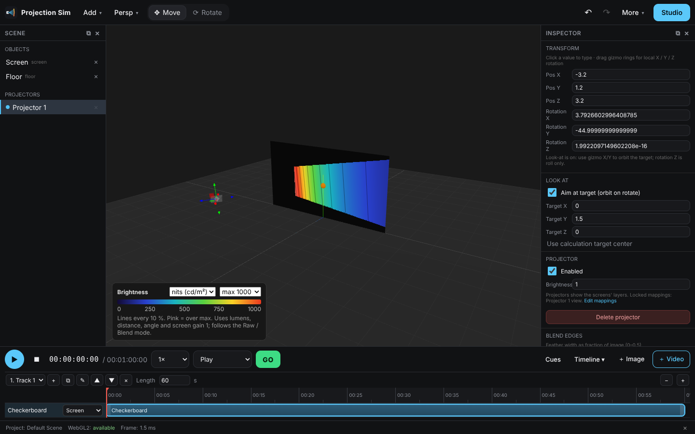

# v5 — previz core

## Projector model & lens (Inspector → Model & lens)

`src/optics/projectorCatalog.ts`: 15 bodies (Barco, Epson, Panasonic, Christie, Sony,
generic) with ANSI lumens, native resolution and lens families (zoom range and lens-shift
range as a fraction of the image). Values are typical published figures — check the
datasheet before ordering.

Picking a model sets lumens, resolution / aspect and the zoom range
(`throwRatioMin/Max`), choosing the lens whose zoom contains the current throw. The panel
shows a zoom slider, how far to hang the projector to fill the calculation target, and
warnings when throw or lens shift is outside the lens. "Custom" keeps hand-entered optics.

`ProjectorConfig` gains optional `lumens` (default 10,000) and `catalog { modelId, lensId }`;
older projects load unchanged.

## Brightness (preview "Brightness (nits / lux)")

`src/optics/illuminance.ts` (CPU) and `multiProjection.frag.glsl` `previewKind 3` (GPU):

* flux per m² at 1 m on axis = Φ / A1, A1 = 1 / (T² · aspect);
* intensity off axis by α: I = (Φ / A1) / cos³α; illuminance E = I · cosθ / r²;
* Φ = lumens × the projector's Brightness multiplier; overlapping projectors add, weighted
  by the blend when the composite mode is Blend;
* nits = lux × screen gain / π; fL = nits / 3.426.

The viewport legend sets unit and scale (lines every 10 %, black where no light lands, magenta above max). Inspector →
Brightness on target gives min / average / max / uniformity on the calculation target
(surface samples, before blending), and the HTML / CSV report lists projector models,
lumens and these figures. `previzSettings { unit, scaleMax, screenGain }` is saved with the
project.

### Spill

With "Show spill on every surface" on (the default), the brightness heatmap paints every
visible surface except LED walls, not just screens. That shows light spilling past the screen
onto walls, floor and set pieces, and the shadows cast by anything with Blocks projection.
Inspector → Brightness on target → Light on target vs spill gives each projector's
lumens landing on the calculation target (∑ E·dA over the visible samples) and the rest as
spill.

## Name

The app is now "Projection Simulator" (tab title, toolbar, output windows, reports), with
a new logo and favicon.
