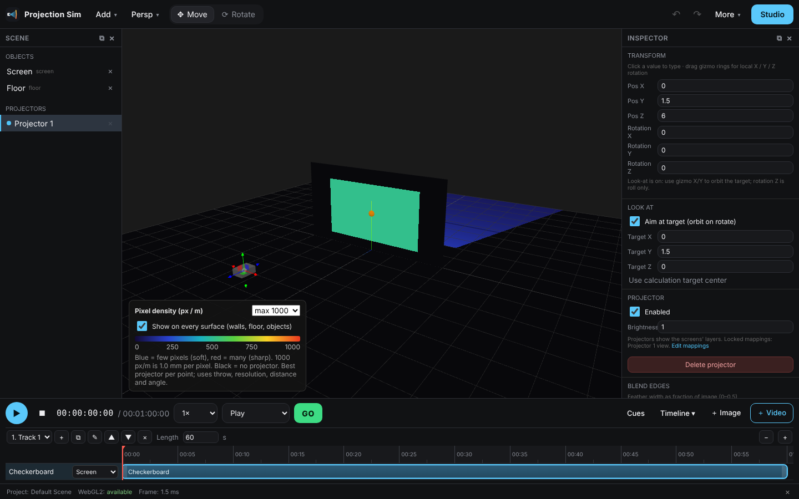
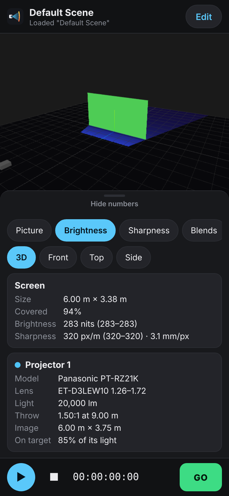

# v6 — verified lenses, auto placement, pixel density, phone view

## Verified projector + lens table (Inspector → Model & lens)

Panasonic, Epson and Optoma now come from the researched table in
`tools/catalog/projector-lenses.csv` (96 bodies, 928 projector + lens pairs, each row
checked against the maker's spec sheets). `node tools/catalog/build-catalog.mjs` rebuilds
`src/optics/data/catalogData.json` from it.

* Throw ratios are per projector + lens: the same lens throws differently on different
  chip sizes.
* Lens shift is checked only where the maker publishes a range; otherwise the panel says so.
* Brightness: ANSI where published. Epson and some Panasonic bodies only publish ISO 21118,
  shown as "ISO" in the model list; a few publish no figure, so lumens stay as entered.
* Each lens shows whether it was confirmed by the maker, with a link to the source.
* Barco, Christie, Sony and the generic bodies keep their typical (approximate) figures.
* Projects saved with v5 model ids (`pana-pt-rz21k` etc.) still open.

## Auto placement

With a calculation target set, the Model & lens section offers:

* **Place to fill (square-on)** — moves the projector onto the screen's axis, facing it,
  at throw × image width, so the image covers the whole screen (fits width, or height for
  a screen taller than the image). Look-at is switched off.
* **Place to fill, keep this height** — same distance, but the projector stays at its
  current height and vertical lens shift moves the image onto the screen. If the lens
  can't shift that far, the projector moves just enough and the status bar says so.
* **Pick lens for this distance** — from where the projector hangs, picks the lens whose
  zoom covers the throw the screen needs.

Curved screens use their chord. Code: `src/optics/autoPlace.ts`.

## Pixel density ("Pixel density (px / m)" preview, Inspector → Pixel density on target)

Pixels per metre on every surface, from the best projector at each point:

    px/m = throw × horizontal resolution × √(cosθ / cos³α) / r

(on axis and square-on this is horizontal resolution / image width). The legend sets the
scale and shows mm per pixel; the Inspector gives softest / average / sharpest on the
target. Rule of thumb: from d metres away people can't see pixels smaller than about
0.3 mm × d.

## Phone view

On a phone the app opens a simple viewer: the 3D view, chips for Picture / Brightness /
Sharpness / Blends and the camera (3D, Front, Top, Side), a "Numbers" sheet with the
target's size, coverage, brightness and sharpness and each projector's model, lens,
lumens, throw distance, image size and light on target, and play / stop / GO. Tapping
the view never selects or moves anything. **Edit** opens the full editor; More → Simple
phone view goes back.

**More → Copy link for phone** (on the computer) puts the whole project into a link (the
`#view=` hash, compressed). Open it on the phone to see the same scene. Nothing is
uploaded. Imported images, videos and 3D models are not in the link; test patterns,
colours and all projector / screen settings are.

