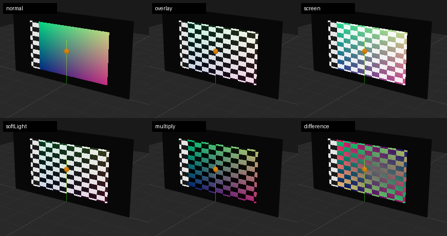
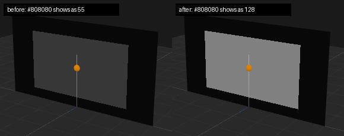

# v7: projection fixes + layer blend modes

## Fixes

- **Colour on surfaces and in projector feeds was too dark.** Content is decoded to
  linear light (sRGB textures), but the projection shader wrote those linear values
  straight to the screen and into the projector feeds without encoding them back.
  A #808080 grey showed as 55 instead of 128, so every image and video looked darker
  and more contrasty than the source, and output windows / feed exports sent that
  darker signal to the projectors. The viewport, feeds and LED walls now encode to
  sRGB. Test patterns are signal levels (Gray 50 % = code 128) and are decoded like
  images, so they look as before.
- **Lens shift H was mirrored.** +V moved the image up but +H moved it left. +H now
  moves it right, as on projector spec sheets. Old projects that used a non-zero
  Shift H will show the image on the other side: flip the sign.
- **Roll with look-at flipped sign.** Typing roll 10° stored −10°, and every re-aim
  flipped it again. Roll is now applied about +Z so it reads back unchanged.

## Layer blend modes

Layer Inspector → Blend: Normal, Add, Screen, Multiply, Overlay, Soft light, Lighten,
Darken, Difference. Normal/Add/Multiply use GPU blending as before. The others copy
the screen texture below the layer and blend in the shader (Photoshop formulas on
sRGB values, then opacity mixes with what is below). CPU mirror: `blendOver` in
src/mapping/sample.ts; tests in src/mapping/blendModes.test.ts.

